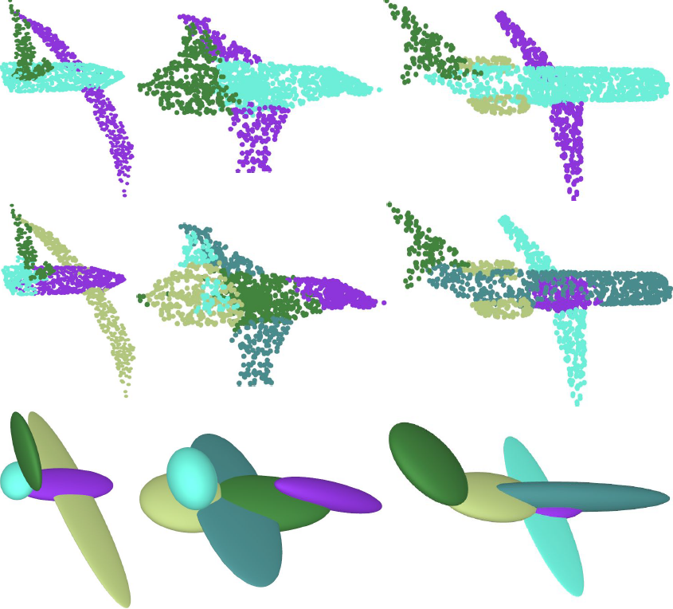

# PRIFIT: Learning to Fit Primitives Improves Few Shot Point Cloud Segmentation
Published at Symposium on Geometry Processing 2022.

[Gopal Sharma](https://hippogriff.github.io/), [Bidya Dash](https://www.linkedin.com/in/bidyadash/), [Aruni RoyChowdhury](https://arunirc.github.io/), [Matheus Gadelha](http://mgadelha.me/), [Marios Loizou](https://marios2019.github.io/), [Liangliang Cao](http://llcao.net/), [Rui Wang](https://people.cs.umass.edu/~ruiwang/), [Erik G. Learned-Miller](https://people.cs.umass.edu/~elm/), [Subhransu Maji](https://people.cs.umass.edu/~smaji/), [Evangelos Kalogerakis](https://people.cs.umass.edu/~kalo/)

***
<p align="center">
  
</p>

**TL;DR** PrimFit uses primitive fitting within a semisupervised
learning framework to learn 3D shape representations.
Top row: 3D shapes represented as point clouds, where the
color indicates the parts such as wings and engines. The induced
partitions and shape reconstruction obtained by fitting ellipsoids to
each shape using our approach are shown in the middle row and
bottom row respectively. The induced partitions often have a significant
overlap with semantic parts.

### Abstract
_We present PrimFit, a  semi-supervised approach for label-efficient learning of 3D point cloud segmentation networks. 
PrimFit combines geometric primitive fitting with point-based representation learning. Its key idea is to learn point representations whose clustering reveals shape regions that can be approximated well by
basic geometric primitives, such as cuboids and ellipsoids. The learned point representations can then be re-used in existing network architectures for 3D point cloud segmentation,
and improves their performance in the few-shot setting. According to our experiments on the widely used ShapeNet and PartNet benchmarks.
PrimFit outperforms several state-of-the-art methods in this setting, suggesting that decomposability into primitives is a useful prior for learning representations predictive of semantic parts.
We present a number of ablative experiments varying the choice of geometric primitives and downstream tasks to demonstrate the effectiveness of the method._

## Environment setup

CUDA setup:
```
CUDA: '9.2.148'    # torch.version.cuda
CuDNN: 7603        # torch.backends.cudnn.version()
```

Conda environment:
```
conda create -n acd-env python=3.6
pip install numpy six protobuf>=3.2.0
pip install torch torchvision
pip install matplotlib tqdm tensorboard_logger trimesh
```

For reference, we also tested using CUDA 10.1, and the corresponding torch and torchvision can be installed using `pip install torch==1.6.0+cu101 torchvision==0.7.0+cu101 -f https://download.pytorch.org/whl/torch_stable.html`.

## Data setup

1. Download part segmentation dataset **ShapeNet** [here](https://shapenet.cs.stanford.edu/media/shapenetcore_partanno_segmentation_benchmark_v0_normal.zip) and save in `data/shapenetcore_partanno_segmentation_benchmark_v0_normal/`.

2. Download the **pre-computed ACD components** for the unlabeled ShapeNet core shapes from [here](http://maxwell.cs.umass.edu/zezhou/visualization/acd/ACDShapeNetSegPartAnno.zip) and extract its content in `data`.

3. Download the aligned and resampled **ModelNet40** dataset for shape classication from [here](https://shapenet.cs.stanford.edu/media/modelnet40_normal_resampled.zip) and save in `data/modelnet40_normal_resampled/`.

Thanks to yanx27 for an excellent PyTorch PointNet++ implementation [Pointnet_Pointnet2_pytorch](https://github.com/yanx27/Pointnet_Pointnet2_pytorch); our model implementation is based off that codebase.

## Few-shot segmentation on ShapeNet

From the project root, the following code snippet trained a model jointly on semantic segmentation on ShapeNetSeg, using 10 samples per shape category (i.e. 10 * 16 = 160 labeled training samples) and a pairwise contrastive loss over ACD components of the unlabeled ShapeNet Core data (for 20 epochs, decaying the learning rate at every epoch, with a batchsize of 24 shapes). 

```
python train_partseg_shapenet_multigpu.py --seed 786 --alpha 0.01 --split val --k_shot 10 \
                                          --batch_size 24 --step_size 1 --selfsup --epoch 20 \
                                          --learning_rate 0.01 --lmbda 1 --quantile 0.05 --msc_iterations 10 --max_num_clusters 25 \
                                          --ss_path $path
```

The models are stored in the experiment output folder, under `checkpoints` sub-folder. Tensorboard logs and console output as txt file are saved under sub-folder `logs`. The test performance is evaluated at the end of the training epochs (i.e. epoch 9 in this case) and written to the logfile. The directory `ss_path` ($path) refers to the directory where pre-computed ACD components for the unlabeled ShapeNet core shapes is downloaded to (2)!

## Pretrain on ACD and test on ModelNet

**Pretraining on ACD:**

The following example command trains a PointNet++ network on the ACD task. The `seed` is an integer that serves as an identifier for multiple runs of the same experiment. Random rotations around the "up" or Z axis is done as data augmentation during training(`--rotation_z`). Only the best performing model based on the **validation ACD loss** is stored under the experiment output folder, under `checkpoints` sub-folder. Tensorboard logs and console output as txt file are saved under sub-folder `logs`.

```
python pretrain_partseg_shapenet.py --rotation_z --seed 1001 --gpu 0 \
                                    --model pointnet2_part_seg_msg  \
                                    --batch_size 16 --step_size 1  \
                                    --selfsup  --retain_overlaps \
                                    --ss_path data/ACDv2
```

**Evaluate pre-trained model on ModelNet40:**

* Evaluating on ModelNet with cross-validation of SVM (takes a while): `python test_acdfeat_modelnet.py --gpu 0  --sqrt  --model pointnet2_part_seg_msg   --log_dir $LOG_DIR  --cross_val_svm`
* Avoiding the cross-validation for the SVM C, one can also explicitly put the value as a runtime argument: `python test_acdfeat_modelnet.py --gpu 0  --sqrt  --model pointnet2_part_seg_msg   --log_dir $LOG_DIR --svm_c 220.0`
* Examples of `LOG_DIR` can be found at the top of the `test_acdfeat_modelnet.py` code file. Basically it points to wherever the ACD pre-training script dumps its outputs.
